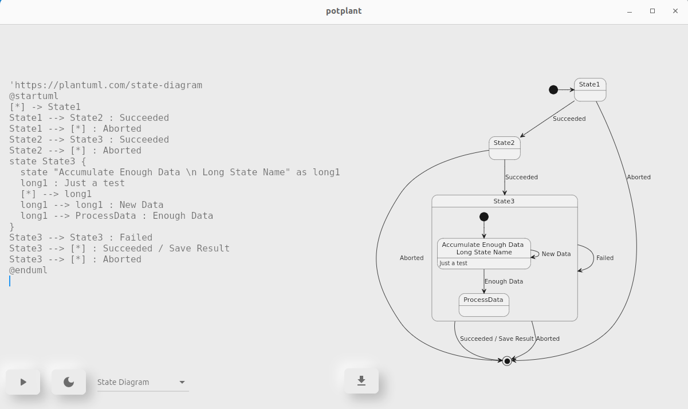

# potplant
 

A desktop application to write and save PlantUML diagrams.

| Version   | Branch          | Platform                               
| :-------: | :-------------: | :------: 
| `x-OSX`   | `release-x`   | OSX                                 
| `x-LNX`   | `release-x`   | Linux                                  
| `x-WIN`   | `release-x`   | Windows                               

